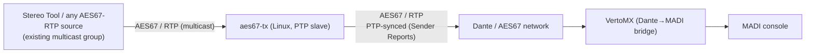

# aes67-tx

[](https://github.com/HansVanEijsden/aes67-tx/actions/workflows/build.yml)
[](https://github.com/HansVanEijsden/aes67-tx/blob/main/LICENSE)

Publish an existing AES67/RTP audio stream as a **PTP-synchronised AES67 (Dante-compatible) source** on Linux.

Many broadcast AES67/Dante receivers (mixers, MADI bridges, Dante Controllers) are strict: a source is only accepted if its RTP timestamps and RTCP **Sender Reports** reference the **PTP clock of the network's grandmaster**. Standard Linux audio tools (GStreamer, ffmpeg, VLC) send RTP on the *system* clock — usually NTP-based and unrelated to the audio-over-IP/PTP domain — so a Dante/AES67 device refuses the stream ("no signal", "no sync", "cannot subscribe: RTP not enabled", …).

`aes67-tx` bridges that gap. It reads an existing AES67/RTP multicast stream and re-publishes it as a new AES67 multicast source whose Sender Reports are timestamped against the machine's **PTP hardware clock (PHC)**, which `ptp4l` slaves to the grandmaster. Because the Sender Reports map the media clock onto the PTP domain clock, an AES67 receiver accepts and locks to the stream.

It is a small, single-file C program with no runtime dependencies beyond a PTP-capable NIC.

---

## Typical use case

A broadcast processor (e.g. **Thimeo Stereo Tool**) emits AES67 / LiveWire audio on one multicast group. You want that same audio available on a mixing console (or a Dante→MADI bridge) that only accepts Dante/AES67 on another group / clock domain.

```
Stereo Tool  ── AES67/RTP ──>  [eth0] aes67-tx  ── AES67/RTP (PTP) ──>  [VertoMX]  ── MADI ──>  console
```

The host running `aes67-tx` must be a **PTP slave of the console's grandmaster**.

---

## How it works



- It forwards the RTP **payload bytes unchanged** (no decode/encode). The output format is therefore the same as the input (e.g. `L24/48000/2`).
- It rewrites the RTP header: new SSRC, new sequence number, and — by default — **re-stamps each packet from the PTP clock** (the PHC), so the media clock runs in lockstep with the grandmaster.
- It sends **RTCP Sender Reports** every second. The Sender Report's timestamp is taken from the **PHC** (the NIC's PTP-synchronised hardware clock), so the receiver can lock the media clock to the PTP grandmaster.
- `--keep-ts` instead forwards the source's own RTP timestamps (only sensible if the source already follows the grandmaster).

---

## Requirements

- Linux with a NIC that exposes a **PTP hardware clock** (`/dev/ptpN`, e.g. an Intel I219/V2V, or many server NICs). Verify: `ethtool -T eth0` shows `hardware-receive`/`hardware-raw-clock` and a "Hardware timestamp provider".
- A **PTP grandmaster** on the network (a Dante/AES67 device often fulfils this role).
- The host configured as a **PTP slave** of that grandmaster with `ptp4l` (`/dev/ptp0` then reflects the domain time). See [Setting up the PTP slave](#setting-up-the-ptp-slave).
- **root** privileges at runtime (to open `/dev/ptpN` and join multicast groups).
- `gcc`/`cc` to build.

The host does **not** need to be NTP-synchronised; run `ptp4l` slave and `chrony`/NTP independently (recommended: keep the system clock on NTP and only use the PHC for AES67 timing).

---

## Build

```sh
make
# or
cc -O2 -Wall -Wextra -o aes67-tx aes67-tx.c

sudo make install   # optional: installs to /usr/local/bin/aes67-tx
```

---

## Example: Stereo Tool → MADI console

End-to-end: take **Thimeo Stereo Tool**'s AES67/LiveWire output and make it available on a
mixing console via a Dante→MADI bridge.

1. **Sync the PTP clock** — the host must follow the console's grandmaster. Configure
   `ptp4l` in slave-only mode and confirm `portState = SLAVE` (see
   [Setting up the PTP slave](#setting-up-the-ptp-slave)).

2. **Publish the stream.** Read Stereo Tool's AES67 output and write it to a fresh group:

```sh
sudo ./aes67-tx \
  -A 239.192.19.137 -P 5004 \      # the existing AES67/RTP source
  -a 239.69.100.1   -p 5004 \      # the new AES67 output group
  -f eth0 -v
```

3. **Subscribe in Dante Controller.** Add the matching SDP (see [Example SDP](#example-sdp) /
   `example-sdp.txt`; change `YOUR-HOST-IP`), then subscribe the flow to your device and
   **route it to the MADI output** (via the VertoMX).

4. **Turn the console on.** The VertoMX converts Dante→MADI; with the console running, the
   (delayed) on-air signal appears on the **MADI console**.

> If the receiver refuses the flow ("RTP not enabled on RX device"), enable **AES67** on the
> receiving device — a hardware Dante/AES67 device, not a DVS (Dante-only) host.

---

## Options

```
-a, --output-addr <addr>   output multicast group            (required)
-p, --output-port <port>   output RTP port                   (default 5004)
-A, --input-addr <addr>    input multicast group             (one of the two)
-P, --input-port <port>    input RTP port                    (default 5004)
-S, --sdp <file>           read input addr/port from an SDP file
-k, --ssrc <hex>           output SSRC                       (0 = random)
-t, --pt <n>               output RTP payload type           (default 96)
-l, --ttl <n>              multicast TTL                     (default 8)
-f, --iface <name>         output interface, e.g. eth0
-d, --ptp-device <path>    PTP hardware clock                (default /dev/ptp0)
-r, --sr-interval <sec>    Sender Report interval            (default 1)
-R, --re-stamp             re-stamp RTP timestamps from the PTP clock (default)
-K, --keep-ts              forward the source RTP timestamps instead
-B, --rate <hz>            RTP clock rate for --re-stamp     (default 48000)
-W, --raw                  read raw PCM on stdin instead of an RTP source
-b, --bit <16|24>          PCM bits per sample for --raw      (default 24)
-C, --channels <n>         channels for --raw                 (default 2)
-n, --pkt <frames>         frames per RTP packet for --raw    (default 48 = 1 ms)
-v, --verbose              log progress to stderr
-h, --help                 show help
```

### Choosing the input

Use either `-A/-P` (address and port) or `-S <sdp-file>`. An SDP is handy when you have the source's session description (Stereo Tool, RAVENNA, etc.); the `c=` and `m=audio` lines are read.

### Choosing the output timestamp strategy

This is the part that makes or breaks a Dante/AES67 receiver accepting the stream.

- **`--re-stamp` (default):** each RTP packet is timestamped **from the PTP clock (PHC)**. The media clock runs *in lockstep* with the grandmaster, which is exactly what Dante requires. **Use this when the source does not follow the grandmaster** — which is the common case (e.g. Stereo Tool, which uses the *system* clock). Specify the session clock rate with `--rate`.

- **`--keep-ts`:** forwards the source's own RTP timestamps. Only use this if the source is already PTP-synchronised. If you forward the timestamps of a *non-PTP* source, the media clock does not run in lockstep with the grandmaster: the receiver sees a "latency" (clock offset) that **jumps around on every stream restart**, and a Dante device will show the flow as **connected but muted** (green, no sound). This is a known symptom when a processor like Stereo Tool emits AES67 without slaving to the grandmaster. `aes67-tx` in `--re-stamp` mode re-timestamps from the PHC so the source *is* in lockstep.

### Feeding it a non-RTP source (--raw)

Use `--raw` when your audio is not already on RTP/AES67 — e.g. a network IceCast/FLAC
stream, a file, or a sound card. It reads raw interleaved PCM from **stdin** and packetises
it as AES67, re-stamping every packet from the PTP clock. Combine it with a decoder that
produces PCM at the session rate, e.g.:

```sh
# 16-bit source -> ffmpeg scales it to 24-bit automatically when you output s24le
ffmpeg -hide_banner -loglevel error -reconnect 1 -reconnect_streamed 1 -reconnect_delay_max 5 \
  -i "https://example.org/station" -vn -f s24le -ar 48000 -ac 2 - \
  | aes67-tx --raw -a 239.69.100.2 -p 5004 -f eth0 -b 24 -C 2 -n 48 -v
```

- `-b 16`/`-b 24` set the PCM width; the AES67 payload becomes `L16`/`L24` accordingly.
- **AES67 L16/L24 are big-endian**; `aes67-tx --raw` byte-swaps the little-endian PCM it
  reads (from ffmpeg) to the big-endian RTP payload automatically.
- **A PCM24 receiver (many Dante bridges) rejects `L16` flows.** If your device is configured
  for 24-bit, output `L24`. When you decode a 16-bit source and write `-f s24le`, ffmpeg
  scales the 16-bit to 24-bit itself, so no extra gain filter is needed.
- `-n 48` = 48 frames/packet (≈1 ms at 48 kHz). Keep the SDP's `a=ptime` in agreement.
- `ffmpeg -reconnect ...` reconnects over short outages; `aes67-tx --raw` exits on upstream
  EOF so a supervising `systemd` unit (`Restart=always`) re-spawns the pipeline for longer
  drops — together this gives automatic reconnection.

### Output interface

Set `-f <iface>` to the interface that carries the output multicast (the one wired to the Dante/AES67 switch). If omitted, the kernel picks the default route interface.

---

## Setting up the PTP slave

The host must expose a PTP-slaved hardware clock. A minimal, **slave-only** `ptp4l` configuration:

```ini
# /etc/linuxptp/aes67.conf
[global]
domainNumber        0
network_transport    UDPv4
delay_mechanism     E2E
```

Run it in **slave-only** mode so this host never becomes a grandmaster (important — you do not want to corrupt the domain):

```sh
sudo ptp4l -i eth0 -s -f /etc/linuxptp/aes67.conf
```

Check it found and follows the grandmaster:

```sh
pmc -u -b 0 "GET PORT_DATA_SET"      # expect portState = SLAVE
pmc -u -b 0 "GET TIME_STATUS_NP"     # expect gmPresent = true and a small master_offset
```

A ready-to-use systemd unit is in **`ptp4l-aes67.service`** (adjust the interface and PTP device). The host's *system clock* can stay on `chrony`/NTP; the PHC is what matters for AES67.

> **Troubleshooting:** if `ptp4l` stays `UNCALIBRATED`, the grandmaster may only answer **unicast** Sender/Delay requests (a common Dante behaviour). Add `hybrid_e2e 1` to the `[global]` section:
> ```ini
> hybrid_e2e          1
> ```
> This makes the slave send its delay request directly to the grandmaster's address rather than as a multicast request.

---

## Example SDP

The output stream is described by an SDP you paste into the controller. It must match the output **payload type**, **media** (`c=`), **port** (`m=audio`), and **encoding**. For a `L24/48000/2` output:

```sdp
v=0
o=- 1 1 IN IP4 <host-ip>
s=AES67-tx re-publication
c=IN IP4 239.69.100.1
t=0 0
m=audio 5004 RTP/AVP 96
a=rtpmap:96 L24/48000/2
a=ptime:1
a=mediaclk:direct=0
```

- Replace `<host-ip>` with the IP of the host running `aes67-tx`.
- Replace the `c=`, `m=audio` and payload type to match your actual output (`-a`, `-p`, `-t`).

Two ready-made examples are in the repository: `example-sdp.txt` (no `ts-refclk`, accepted by most controllers) and `example-sdp-refclk.txt` (adds the PTP reference).

### Subscribing in Dante Controller

1. **File → External SDP Sessions → Add**, paste the SDP, OK. The source should appear.
2. Select your device (the mixer, the MADI bridge, the DVS host). If a receiver complains **"RTP not enabled on RX device"**, enable **AES67** in that device's config — note that *Dante Virtual Soundcard (DVS)* is Dante-only and does **not** receive AES67; use a hardware Dante/AES67 device instead.
3. Subscribe the new channels and route them to the output, then confirm the flow shows signal/audio.

> **Each SDP needs a unique session ID.** Dante Controller identifies an External SDP Session by the *session id* in the `o=` line (the number after the username, e.g. `o=- 1 1 IN IP4 ...`). If you import a second SDP that uses the same session id, Dante asks *"A session with session ID N already exists. Do you want to replace the existing session?"*. Give every imported SDP its own session id — e.g. use `o=- 1 1 ...`, `o=- 2 1 ...`, `o=- 3 1 ...` for successive sources.

---

## Where the audio ends up

The newly published source is a normal AES67 multicast stream on the output group. You can route it to any AES67/Dante receiver. Because the receiver is typically a hybrid Dante/AES67 network, you normally:

- enable AES67 on the receiving device, and
- subscribe the source from the "External SDP Session" entry, then
- assign that flow to the desired Dante channels / MADI outputs.

---

## Troubleshooting

| Symptom | Likely cause / fix |
|---|---|
| Source appears but subscription is refused, or flow is red | The stream is not PTP-synced. Make sure the host is a PTP slave (`portState = SLAVE`) and Sender Reports are being sent (`tcpdump ... port 5005`). |
| "RTP not enabled on RX device" | Enable AES67 on the receiving device. DVS (Dante Virtual Soundcard) has no AES67 receive — use a hardware Dante/AES67 device. |
| `ptp4l` stuck in `UNCALIBRATED` | The grandmaster only answers unicast delay requests — add `hybrid_e2e 1` (see above). |
| Flow is green but **muted**, or no "playing" speaker; latency value jumps on each restart | The media clock is not in lockstep with the grandmaster — likely because the source's timestamps are forwarded instead of re-stamped. Use the default **`--re-stamp`** (ensure you are not passing `--keep-ts`). |
| Flow is green but no signal on the mixer | The destination (e.g. a MADI/console output) may be inactive, or the AES67 source needs `ts-refclk` to fully lock. Try `example-sdp-refclk.txt`. |
| No audio data / silence | Check the source multicast is flowing (`tcpdump -i eth0 "udp port 5004"`), that you are using the right interface (`-f`), and that the source is not silent. |
| Sender Report interval too aggressive | `--sr-interval` is in seconds; leave at least 1. |

---

## Real-world examples (two streams)

The repository includes working `systemd` units under `examples/` that publish two channels
simultaneously on one host, each on its own multicast group:

- `examples/aes67-1zwolle-hd.service` — re-publishes a source AES67/RTP stream (a broadcast
  processor / LiveWire) as **L24** AES67 on `239.69.100.1`.
- `examples/aes67-salland1-hd.service` — decodes a network IceCast/FLAC stream with ffmpeg,
  scales the 16-bit source to 24-bit and publishes it as **L24** AES67 on `239.69.100.2`
  (handy when the studio can't yet send AES67/Dante directly), with automatic reconnection on
  internet drops.

Each channel uses its own output group and its own SDP: `example-sdp.txt` (L24) and
`example-sdp-salland1.txt` (L24, from a 16-bit source). Install and start them with:

```sh
sudo cp examples/*.service /etc/systemd/system/
sudo systemctl daemon-reload
sudo systemctl enable --now aes67-1zwolle-hd aes67-salland1-hd
```

Both units wait for the PTP slave (`ptp4l-slave-eno1.service`) before starting, so the PTP
clock is ready before the AES67 sources come up.

---

## License

MIT License. Copyright © 2026 **Hans van Eijsden / Hans van Eijsden Consultancy**. See `LICENSE`.

## Credits / context

This tool was created out of a real broadcast setup: publishing a Stereo Tool AES67/LiveWire stream onto a Dante network (VertoMX → MADI → console). It is intentionally small and dependency-free so it is easy to audit and adapt.
